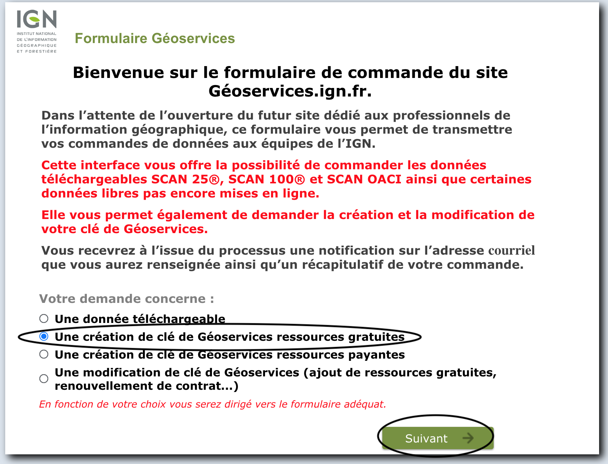
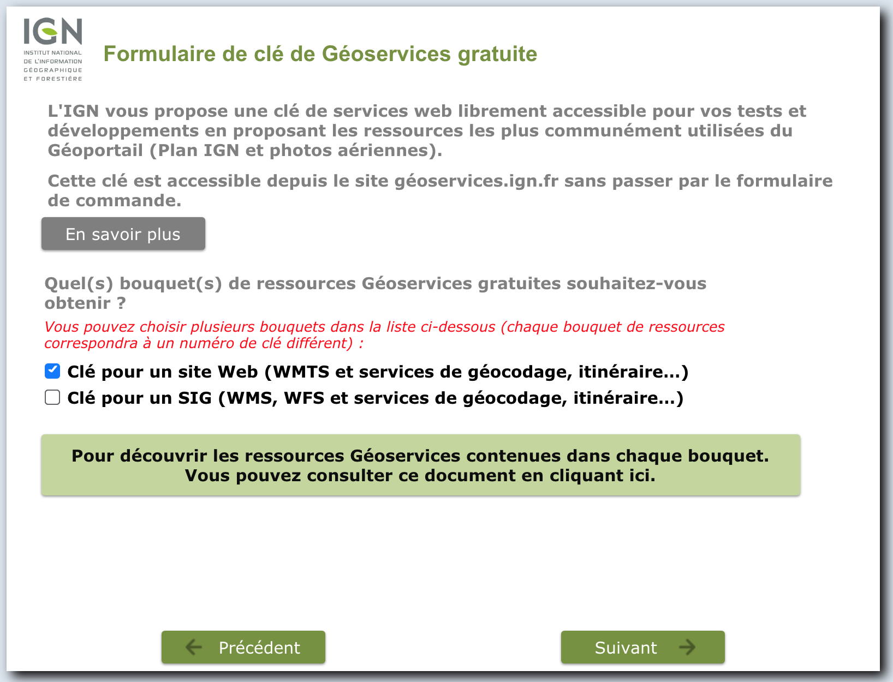
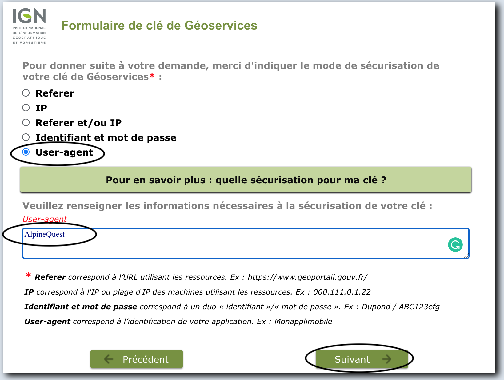
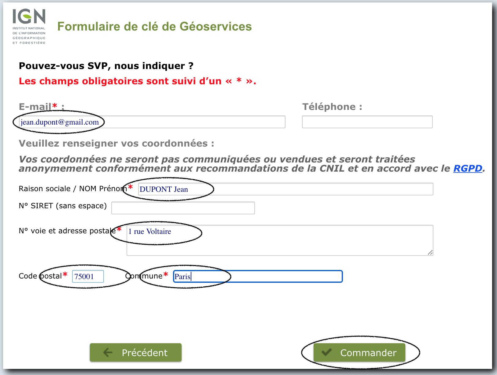

# Souscription à Géoservices

le site internet https://www.geoportail.gouv.fr/ met à disposition gratuitement certaines données de l'IGN. Il est possible à des applications tierces comme l'application mobile iphigénie ou des sites tiers de cartographie de tirer profit gratuitement de ces données à travers les Géoservices IGN.

Dans le cadre de la démarche Open-Data, Géoservices est accessible gratuitement  aux particuliers. À date du 1 mars 2021, il est cependant toujours nécessaire de demander auprès de Géoservices la création d'une clé afin d'accéder aux données.

Cette clé sera ensuite à mentionner dans le fichier de configuration d'AlpineQuest décrivant comment accéder aux cartes IGN.

Voici les étapes permettant d'obtenir une clé Géoservices.

1. Ouvrir le formulaire de demande: https://www.sphinxonline.com/surveyserver/s/etudesmk/Geoservices_2021/questionnaire.htm#49
    
1. Choisir une clé pour un site Web (WMTS ...)
    
1. Utiliser le mode de sécurité "User-agent" avec comme valeur `AlpineQuest`
    
1. Renseigner vos informations personnelles et Commander la clé.
    
1. Une clé d'utilisation vous est envoyée par courriel, sous un jour ouvré en général.
